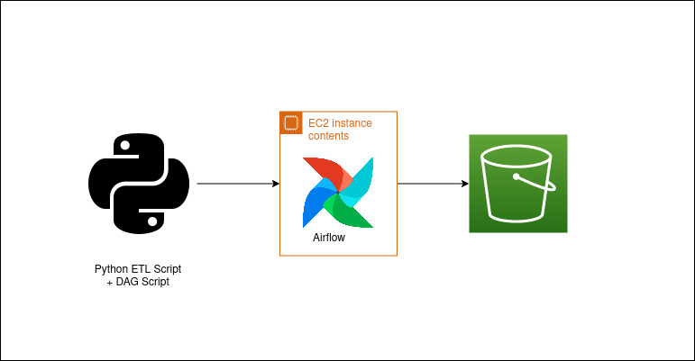

# python_airflow_etl

A Simple ETL Pipeline using Airflow.

Perform the following using a single Python Operator:
1. Extracting data from a web source (imdb for top 50 animes)
2. Transforming data in a required structure (Change data types, clean data etc.)
3. Load the data on S3

Pipeline:

